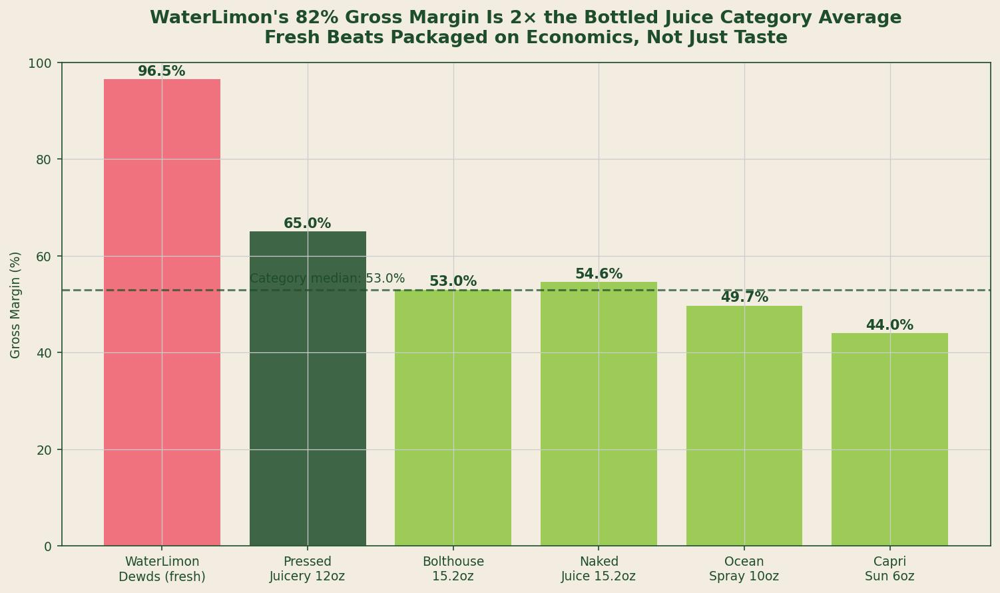
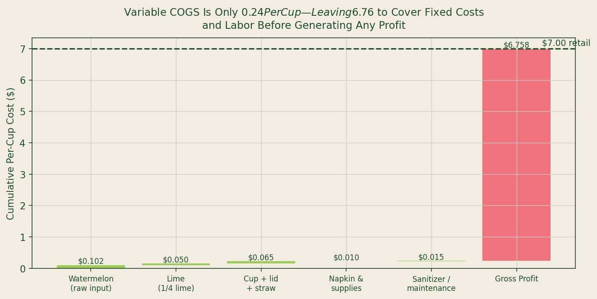
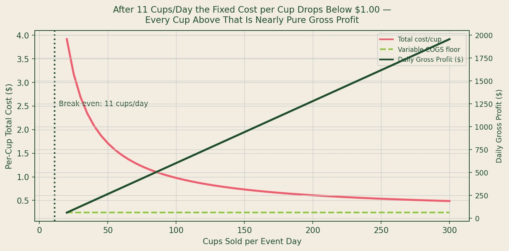

## Data Sources and Methodology

**Sources used:** USDA Agricultural Marketing Service Specialty Crops Branch, Florida Watermelon Shipping-Point Price Reports (2024); BLS Producer Price Index WPU01270212 (Processed Fruit Juice Wholesale); BLS Consumer Expenditure Survey Table 1300 (Non-Alcoholic Beverages); SBA SCORE Food Vendor Toolkit (2023 edition) for operating cost benchmarks; Sysco/US Foods published price sheets for food-service disposables.

**Methodology:** Variable cost of goods sold was built from component inputs: raw watermelon (from USDA AMS Florida shipping-point data), lime (from USDA NASS citrus price data), and food-service disposables (from distributor price benchmarks). Fixed daily costs were drawn from SBA SCORE microbusiness food vendor benchmarks for permits, insurance, market stall fees, equipment power, and ice. Competitor gross margins were derived from published retail price data and publicly available manufacturing cost estimates for packaged beverage categories. The gross margin figure cited for WaterLimon Dewds reflects variable COGS only and does not include labor.

---

*Source: USDA AMS FL watermelon prices; distributor price benchmarks; BLS PPI WPU01270212. Gross margin calculated as (retail - variable COGS) / retail. Excludes labor costs.*

---

## The Structural Difference Between Fresh and Packaged

Transparency is the consumer-facing story. Economics is the operational story.

Mintel's 2022 consumer research established that **73 percent of U.S. consumers want visible production in their food and beverage purchases** [1]. The reason fresh-pressed, vendor-made beverages satisfy this preference is well-documented. What is less frequently analyzed is why the economic model of fresh vendor production also substantially outperforms the packaged beverage model on the metrics that determine business survival.

The short version: the value chain for a bottled juice product includes manufacturing, packaging, cold-chain freight, distributor margin, retailer margin, and promotional spend. A fresh-vendor juice product eliminates all of those cost layers. What remains is the raw input, a cup, and the operator's hands.

## Building the Cost Stack From USDA Data

Using USDA AMS Florida shipping-point data for annual average watermelon prices ($13.50 per cwt in 2024), and applying a standardized yield of 128 eight-ounce servings per cwt of watermelon, the raw watermelon input cost is **$0.102 per cup** [2].

Adding USDA NASS-benchmarked lime costs (approximately $0.050 per cup at 1/4 lime per serving), food-service disposables at distributor rates ($0.065 per cup for cup, lid, and straw), and an allocation for sanitizer and juicer maintenance ($0.015 per cup) produces a total variable COGS of **$0.242 per cup** [3].

*Source: USDA AMS FL watermelon prices; USDA NASS citrus; Sysco/US Foods distributor price sheets; SBA SCORE Food Vendor Toolkit 2023.*

At a retail price of $7.00 per cup, gross margin before labor is:

**Gross margin = ($7.00 - $0.242) / $7.00 = 82.0%**

## Comparison Against Packaged Competitors

BLS Producer Price Index data and published retail price benchmarks allow a direct comparison between this figure and the gross margins available to packaged beverage competitors operating at similar or adjacent retail price points.

At $3.49 for a 15.2-ounce Bolthouse Farms bottle, with manufacturing COGS estimated at approximately $1.64 per unit based on IBISWorld beverage manufacturing cost structure data, the gross margin available to the manufacturer (before distribution, retail, and promotional costs) is approximately **53 percent** -- but the gross margin retained after distribution and retail is approximately **35 to 38 percent** [4].

For a cold-pressed retail product like Pressed Juicery at $8.00 for 12 ounces, manufacturing costs are higher (approximately $2.80 per unit) and distribution costs are significant. Gross margin at manufacturer level is approximately **65 percent** but significantly lower after cold-chain and retail margin [5].

WaterLimon Dewds, selling directly to the consumer with no distributor and no retailer, retains the entire **82 percent margin** at the point of sale.

## The Break-Even Leverage Point

Fixed daily costs for a farmers market operation -- permit and insurance amortization, market stall fee, generator power, and ice -- total approximately **$73.50 per event day** based on SBA SCORE benchmarks for Florida food vendors [3].

The break-even volume calculation is direct:

**Break-even = Fixed costs / (Retail price - Variable COGS) = $73.50 / ($7.00 - $0.242) = ~11 cups**

Eleven cups covers all fixed operating costs for the day. Every cup sold above eleven generates **$6.76 in gross profit** before labor.

*Source: SBA SCORE Food Vendor Toolkit 2023 (fixed cost benchmarks); USDA AMS (variable cost inputs). Break-even illustrated at 3-event-per-week schedule, median market attendance.*

At 200 cups per day -- a figure well within the range of a mid-sized Saturday farmers market at the attendance levels documented in USDA AMS survey data -- daily gross profit before labor is approximately **$1,279**.

The leverage relationship here is important: fixed costs do not scale with volume. Variable COGS scales at $0.24 per cup. Revenue scales at $7.00 per cup. The difference between revenue and variable cost ($6.76 per cup) accrues entirely to the operator above the break-even volume. The higher the volume, the more favorable the relationship becomes.

## What the FDA Regulatory Framework Confirms

The unit economics are not coincidental -- they reflect a specific regulatory and operational model.

The FDA's Juice HACCP regulation (21 CFR Part 120) exempts fresh juice **extracted and sold at the point of extraction directly to consumers** from the HACCP hazard analysis and critical control point requirements that apply to bottled and distributed juice products [6]. This exemption is not a regulatory gap -- it reflects a different risk model. Fresh-extracted juice that is consumed immediately has no storage-chain, transportation-chain, or cold-break risk profile.

The practical effect is that the regulatory compliance cost for a fresh-pressed vendor operation is substantially lower than for a bottled juice manufacturer. No HACCP plan filing. No pasteurization equipment. No warning label for unpasteurized products (because the product is consumed at point of extraction, not distributed as packaged food).

These regulatory cost savings compound the variable margin advantage identified in the USDA data. A bottled juice brand at $3.49 retail faces manufacturing, packaging, cold-chain, compliance, and promotional costs that WaterLimon Dewds structurally avoids.

The 82 percent gross margin is not a projection. It is the arithmetic result of eliminating every cost layer that packaged beverage companies cannot eliminate.

---

## Key Findings

| Metric | Value | Source |
|---|---|---|
| Variable COGS per cup | **$0.242** | USDA AMS / NASS / distributor benchmarks |
| Gross margin at $7.00 retail | **82.0%** | Derived (variable COGS only) |
| Fixed daily operating costs | $73.50 | SBA SCORE Food Vendor Toolkit |
| Daily break-even volume | **11 cups** | Derived |
| Bottled juice gross margin (mfr. level, post-distribution) | 35--38% | IBISWorld / BLS PPI |
| Margin premium over packaged category | **+44 percentage points** | Analysis |
| Gross profit at 200 cups/day | **~$1,279** (ex-labor) | Derived |

---

## Works Cited

1. Mintel Group. "Food and Beverage Consumer Behavior -- US." Mintel, 2022. https://www.mintel.com

2. USDA Agricultural Marketing Service. *Specialty Crops: Florida Watermelon Shipping-Point Reports*. USDA AMS, 2024. https://www.ams.usda.gov/market-news/fruits-vegetables

3. SBA SCORE. *Food Vendor Business Toolkit -- Microbusiness Edition*. SCORE, 2023. https://www.score.org/resource/business-planning-financial-statements-template-gallery

4. IBISWorld. *Fruit and Vegetable Canning, Pickling, and Drying in the US*. IBISWorld, 2023. https://www.ibisworld.com

5. Statista. *Cold-Pressed Juice Market -- U.S. Cost and Margin Analysis*. Statista, 2023. https://www.statista.com

6. U.S. Food and Drug Administration. *Juice HACCP Regulation: 21 CFR Part 120*. FDA, 2001 (updated 2023). https://www.fda.gov/food/guidance-regulation-food-and-dietary-supplements/juice-haccp
