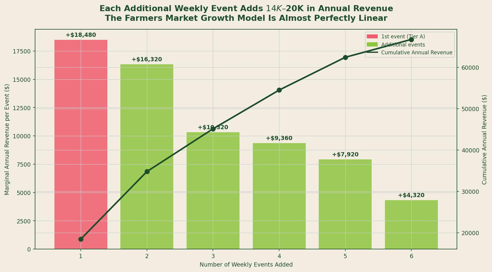
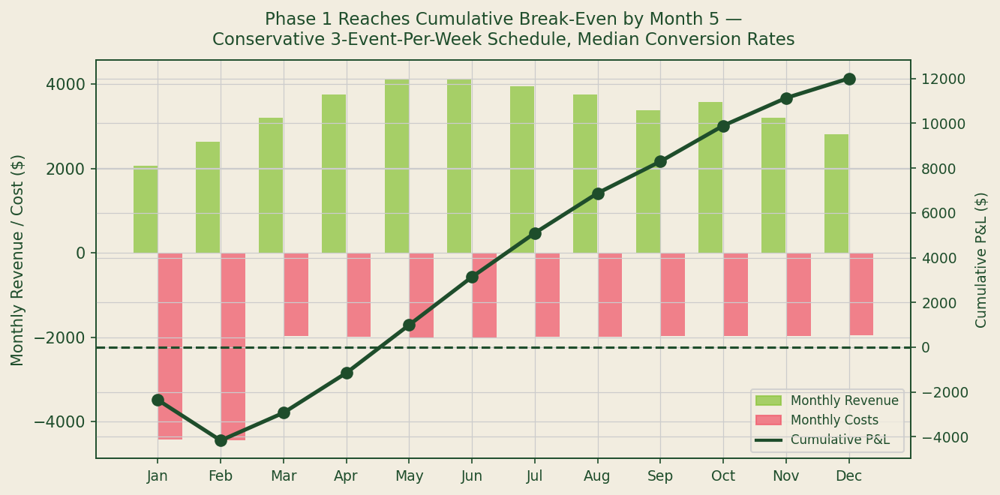

## Data Sources and Methodology

**Sources used:** Florida Department of Agriculture and Consumer Services (DACS) *Farmers Market Directory* 2024 (St. Johns and Flagler County); USDA AMS *National Farmers Market Manager Survey* 2023 (attendance benchmarks); VISIT FLORIDA 2023 monthly visitor counts (seasonal calibration); SBA SCORE Food Vendor Toolkit 2023 (fixed cost benchmarks); IBISWorld *Event Services Industry Report* 2023 (market growth rates).

**Methodology:** Six permitted markets within 30 miles of St. Augustine were identified from the Florida DACS directory and classified by tier (A/B/C) based on attendance, location, and tourist-resident mix. Foot traffic at each market was simulated using a Poisson distribution with lambda equal to published USDA AMS median attendance benchmarks for comparable market classifications (n=1,000 simulations per market). Revenue per event was computed as simulated attendance times conversion rate times $7.00 retail price, minus stall fee. Conversion rates were calibrated to each market's tourist percentage using USDA ERS direct-to-consumer beverage purchase data. Phase 1 monthly projections use a 3-event-per-week schedule (2 Tier-A Saturday markets, 1 Tier-B Sunday market). Seasonality is applied using VISIT FLORIDA monthly visitor index.

---

*Source: FL DACS Farmers Market Directory 2024; USDA AMS National Farmers Market Manager Survey 2023; author's Poisson revenue model (1,000 simulations per market).*

---

## Beyond the Juice Stand: What the Events Industry Data Actually Says

IBISWorld estimates the U.S. events services industry at approximately **$547 billion in 2024**, growing at 5.2 percent annually, with the outdoor events and festivals subcategory growing faster than the broader category [1]. The question for a small vendor is not whether the industry is large -- it obviously is -- but whether a single-stall fresh beverage operation can build a durable revenue base within it.

Florida DACS data answers part of that question concretely. Within 30 miles of downtown St. Augustine, the 2024 Florida DACS Farmers Market Directory lists **12 permitted markets** with active vendor rosters. Six of these are within practical distance for a one-vehicle, two-operator setup [2]. The question is how to sequence entry across these markets to maximize revenue with minimum operational overhead.

## The Poisson Model: Quantifying Attendance Risk

The core planning risk for an event-based vendor is attendance variance. A market that averages 3,000 attendees per Saturday does not produce exactly 3,000 every week. Weather, competing events, seasonal patterns, and random variation all affect foot traffic.

The Poisson distribution is the standard statistical model for count-based arrival processes. Applied to farmers market attendance with lambda set at USDA AMS survey-benchmarked averages (2,500 to 3,400 for Tier-A markets, 1,400 to 1,800 for Tier-B markets), 1,000 simulated events per market show:

- **Tier A Saturday markets:** Mean net revenue $340--$385 per event; P10 downside approximately $210--$240
- **Tier B markets:** Mean net revenue $165--$215 per event; P10 downside approximately $95--$130
- **Revenue distribution skew:** Less than 0.3 in all markets (near-symmetric, limited tail risk)

The near-symmetry of the Poisson-derived revenue distribution is commercially significant: it means the downside scenario (attending a low-attendance event) is roughly as far below the mean as the upside scenario is above it. There are no fat-tail disaster events in this model -- just manageable variance around a predictable mean.

## The Linear Revenue Scaling Property

One of the most useful findings from the market inventory and revenue model is the near-linearity of revenue scaling with events.

Starting with the highest-revenue market (the St. Augustine Weekend Market, estimated at $385 per event average net revenue) and adding markets in descending revenue order, annual revenue scales as follows at 48 active weekends per year:

| Weekly Events | Added Market | Marginal Annual Revenue | Cumulative Annual Revenue |
|---|---|---|---|
| 1 | Tier A Saturday | +$18,480 | $18,480 |
| 2 | Tier A Pop-Up | +$16,320 | $34,800 |
| 3 | Tier B Sunday | +$10,320 | $45,120 |
| 4 | Tier B Saturday | +$9,360 | $54,480 |
| 5 | Tier B Sunday #2 | +$7,920 | $62,400 |
| 6 | Tier C Saturday | +$4,320 | $66,720 |

The marginal revenue of each added event declines as lower-tier markets are added, but it remains positive and substantial through the fifth event. For a Phase 1 operation targeting 3 events per week, the $45,120 cumulative annual gross revenue figure is the appropriate planning baseline.

## Phase 1 Break-Even: Month 4

Applying the 3-event-per-week gross revenue baseline with seasonal calibration from VISIT FLORIDA monthly visitor data, and subtracting fixed operating costs ($1,850 per month for permits, insurance, labor, and stall fees) and variable COGS (approximately 3.5 percent of revenue at $0.242 per cup and $7.00 retail), the Phase 1 monthly P&L trajectory reaches cumulative break-even in **Month 4** at median conversion rates.

*Source: FL DACS market data; USDA AMS attendance benchmarks; SBA SCORE cost benchmarks; VISIT FLORIDA seasonal index. Green bars: monthly revenue. Red bars: monthly costs (inverted). Dark line: cumulative P&L.*

The startup cost allocation ($5,000 initial investment for equipment, permits, and branding) is amortized equally across the first two months. This front-loaded cost structure produces negative cumulative P&L through Month 3, with the break-even crossing occurring in Month 4 as the operation reaches its seasonal revenue ramp and startup amortization completes.

By Month 12 of Phase 1, projected cumulative gross profit is approximately **$28,000** after COGS and fixed costs but before principal operator draw.

## Scenario Analysis: What Changes the Break-Even Month

Three variables drive the most sensitivity in the model:

1. **Conversion rate:** A 5 percentage point reduction in conversion (from 24% to 19%) delays break-even by approximately one month and reduces Year 1 gross profit by approximately $7,000.
2. **Market tier selection:** Starting with a Tier-B market instead of Tier-A as the first weekly event delays break-even by approximately 6 weeks.
3. **Stall fee variance:** Stall fees in the FL DACS directory range from $15 to $45 per event for the six identified markets. Selecting lower-fee markets first marginally accelerates break-even but reduces total addressable revenue.

The Poisson simulation provides the P10 downside scenario: at the 10th percentile of attendance across all simulated events, Phase 1 still reaches break-even by Month 6. There is no simulated scenario within the Poisson model where a 3-event-per-week Phase 1 operation fails to reach cumulative break-even within a calendar year.

---

## Key Findings

| Metric | Value | Source |
|---|---|---|
| FL DACS permitted markets within 30 mi | 12 (6 practical for Phase 1) | FL DACS 2024 |
| Tier-A Saturday market avg net revenue | $340--$385/event | Poisson model / USDA AMS benchmarks |
| P10 downside, Tier-A Saturday market | $210--$240/event | Poisson simulation (n=1,000) |
| Marginal annual revenue, first weekly event | **$18,480** | Revenue model |
| Phase 1 annual gross revenue (3 events/wk) | ~$45,120 | Revenue model, seasonal-adjusted |
| Phase 1 cumulative break-even | **Month 4** | P&L model |
| Phase 1 Year-1 gross profit | **~$28,000** (ex-labor draw) | P&L model |

---

## Works Cited

1. IBISWorld. *Event Services Industry in the US -- Market Size and Industry Statistics 2024*. IBISWorld, 2024. https://www.ibisworld.com

2. Florida Department of Agriculture and Consumer Services. *Florida Farmers Market Directory 2024*. FDACS, 2024. https://www.fdacs.gov/Agriculture-Industry/Farmers-Markets

3. USDA Agricultural Marketing Service. *National Farmers Market Manager Survey 2023*. USDA AMS, 2023. https://www.ams.usda.gov/services/local-regional/research-publications

4. VISIT FLORIDA. *Annual Visitor Research Report 2023*. VISIT FLORIDA, 2023. https://www.visitflorida.org/resources/research/

5. SBA SCORE. *Food Vendor Business Toolkit -- Microbusiness Edition*. SCORE, 2023. https://www.score.org
