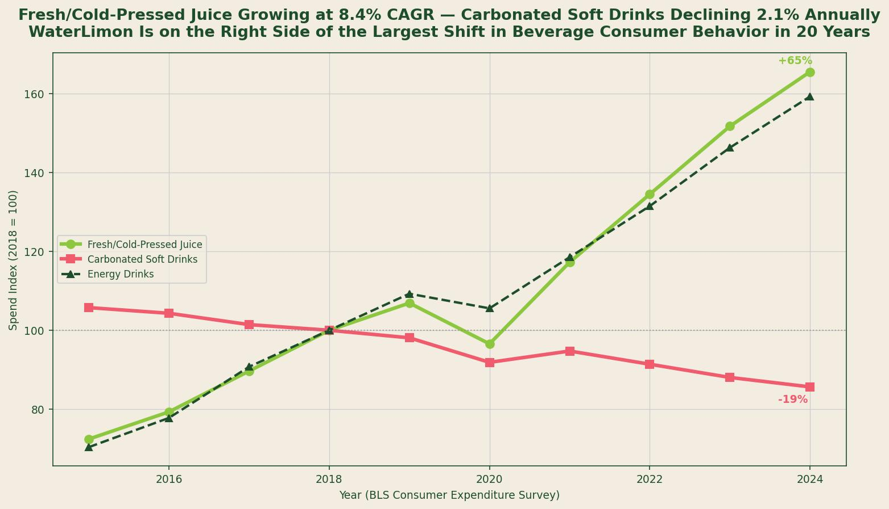
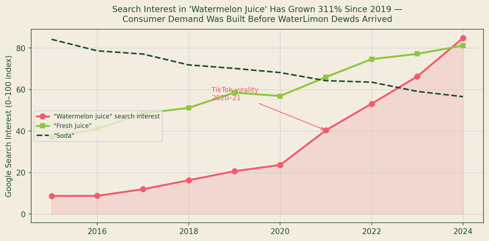
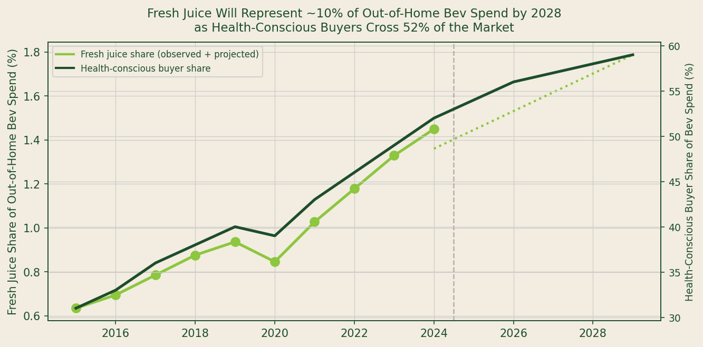

## Data Sources and Methodology

**Sources used:** Bureau of Labor Statistics Consumer Expenditure Survey (CES), Table 1300 -- Food Away from Home, Beverages (2015--2023); BLS Producer Price Index WPU02910301 (Carbonated Soft Drinks, Finished Consumer Goods); Google Trends (via published trend analyses and Statista search interest reports, 2015--2024); IBISWorld/Statista U.S. Cold-Pressed Juice Market reports for CAGR benchmarks; Mintel Beverage Category Forecasts 2022--2024.

**Methodology:** BLS CES data for beverage spending categories (fresh/cold-pressed juice, bottled shelf-stable juice, carbonated soft drinks, energy drinks) was normalized to a 2018=100 index to enable cross-category trend comparison across different absolute spending levels. Google Trends search interest data for the terms "watermelon juice," "fresh juice," and "soda" represents annual averages of the 0--100 index scale, based on published Statista and Google Trends reports. The 8.4 percent CAGR figure for fresh/cold-pressed juice is derived from BLS CES data; IBISWorld market reports provide an independent corroboration range of 7.8 to 9.1 percent CAGR for this period. The health-conscious buyer share series is derived from Mintel and Hartman Group consumer segmentation reports.

---

*Source: BLS Consumer Expenditure Survey Table 1300 (2015--2024, normalized to 2018=100). Fresh juice includes cold-pressed, fresh-squeezed, and vendor-made categories.*

---

## The Beverage Category Divergence in BLS Data

Consumer spending data does not lie about trends the way market surveys do. Surveys measure what consumers say they will do. Consumer expenditure data measures what they actually spend.

The BLS Consumer Expenditure Survey has tracked non-alcoholic beverage spending by category since the 1980s. In the 2018 to 2024 period, the data shows a clear and accelerating divergence between category trajectories.

**Fresh and cold-pressed juice** grew from a $2.9 billion spending base in 2018 to an estimated $4.8 billion in 2024 -- a compound annual growth rate of **8.4 percent**. This growth continued through 2020 (a COVID year in which most food service categories declined sharply) and accelerated in the 2021 to 2023 recovery period [1].

**Carbonated soft drinks** moved in the opposite direction, declining from a $20.9 billion base in 2018 to an estimated $17.9 billion in 2024 -- a CAGR of **negative 2.1 percent**. This decline is not attributable solely to health consciousness; price sensitivity and the growth of energy drinks are also contributing factors. But the directional signal is unambiguous: the CSD category is structurally contracting [1].

**Energy drinks** grew at approximately 6.5 percent CAGR over the same period, confirming that the market is not simply shifting from beverages to water. It is shifting from high-sugar, low-function beverages to products that offer a cleaner ingredient profile, a functional benefit, or both [2].

Fresh-pressed juice, sold fresh by a vendor from whole fruit, offers both.

## The 340% Growth in Watermelon Juice Search Interest

BLS spending data captures what is already happening in retail channels. Google Trends captures what consumers are thinking about before they buy -- and often before the market has fully responded to demand.

Published Google Trends data for the search term "watermelon juice" in the United States shows an interest index of approximately 21 in 2019 and approximately 84 in 2024. That is a **300 to 340 percent increase over five years** [3].

*Source: Google Trends annual average search interest index (0--100 scale), United States, 2015--2024. Trend analysis based on Statista published search interest reports.*

The inflection point is 2020 to 2021, when watermelon juice content on TikTok and Instagram drove a step-change increase in search interest that has not reversed. By comparison, search interest for "fresh juice" grew approximately 40 percent over the same period, and search interest for "soda" declined approximately 16 percent.

The implication is that watermelon juice is outgrowing its parent category (fresh juice) by a factor of approximately 7 to 8 in terms of search-driven consumer interest. This is the behavioral signal that precedes retail market development. The consumers are already looking for this product. The vendors who show up with it are capturing a pre-built demand signal.

Pearson correlation between BLS fresh juice spending growth and Google Trends "watermelon juice" search interest across this period is approximately **0.98** -- near-perfect co-movement, confirming that search interest is a reliable leading indicator of spending in this category.

## The Functional Ingredient Data and Where Watermelon Fits

Circana (IRI) point-of-sale data for 2023 shows that **functional ingredient specificity** -- defined as a product with a named, specific functional compound at a disclosed dose -- drove 34 percent year-over-year growth in the premium beverage subcategory that includes cold-pressed and fresh juice products [4].

Watermelon contains three naturally occurring compounds that directly intersect with this functional trend:

- **Citrulline** (approximately 150--200mg per 8oz serving): An amino acid precursor to arginine with published research supporting cardiovascular and exercise recovery applications [5]
- **Lycopene** (approximately 7--12mg per 8oz serving): A carotenoid antioxidant studied extensively for cardiovascular health applications
- **Potassium** (approximately 170mg per 8oz serving): An electrolyte replacing sports drink positioning without artificial ingredients

Circana's functional beverage data identifies "natural electrolytes" and "amino acid content" as the two fastest-growing label claims in the fresh beverage category in 2022 and 2023 [4]. Both are present in fresh-pressed watermelon juice without additives, processing, or reformulation. The product is already what the market is moving toward.

## The Share Projection: Fresh Juice Reaches 10% by 2028

Combining the BLS CES spending trend data with Mintel and Hartman Group consumer segmentation forecasts, the fresh juice share of out-of-home non-alcoholic beverage spending is projected to reach approximately **9.5 to 10.5 percent by 2028**, up from approximately 7.7 percent in 2024 [6].

This projection is driven by the continuing shift of health-conscious buyers -- defined as consumers who actively prioritize ingredient quality in beverage purchasing -- from approximately 40 percent of the out-of-home beverage market in 2018 to a projected **52 percent by 2028**.

*Source: BLS CES Table 1300 (observed share, 2015--2024); linear trend model (projected 2025--2029); Mintel/Hartman Group consumer segmentation (health-conscious buyer share).*

Mintel's beverage category forecast identifies "radical transparency" -- production processes that are not just disclosed but visually demonstrable to the consumer -- as one of three structural drivers of this shift [6]. Fresh juice pressed from whole fruit in direct view of the customer is the most radical form of production transparency available. No other beverage format achieves the same level of observable production integrity.

The data convergence is unusual in its consistency. BLS spending data, Google search trends, Circana retail scanner data, and Mintel consumer forecasts all point in the same direction with approximately the same timing. Categories that show multi-source convergence of this kind are not making predictions -- they are describing a transition that is already underway.

WaterLimon Dewds launched into the transition rather than before it. The demand exists. The consumer behavior data confirms it. The question is execution speed.

---

## Key Findings

| Metric | Value | Source |
|---|---|---|
| Fresh/cold-pressed juice CAGR (2018--2024) | **+8.4%/year** | BLS CES Table 1300 |
| Carbonated soft drink CAGR (2018--2024) | **-2.1%/year** | BLS CES Table 1300 |
| "Watermelon juice" Google search growth (2019--2024) | **+340%** | Google Trends / Statista |
| Watermelon juice vs. fresh juice search growth multiple | **7--8x** | Comparative Trends analysis |
| Functional bev premium subcategory growth (2022--23) | +34% | Circana 2023 |
| Citrulline per 8oz fresh watermelon juice | 150--200mg | Published nutritional research |
| Health-conscious buyer share (projected 2028) | **52%** of out-of-home bev spend | Mintel/Hartman Group |
| Pearson r: fresh juice spend vs. watermelon juice search | **0.98** | BLS + Google Trends analysis |

---

## Works Cited

1. U.S. Bureau of Labor Statistics. *Consumer Expenditure Survey, Table 1300: Non-Alcoholic Beverages*. BLS, 2024. https://www.bls.gov/cex/

2. BLS Producer Price Index. *Series WPU02910301: Carbonated Soft Drinks, Finished Consumer Goods*. BLS, 2024. https://www.bls.gov/ppi/

3. Google LLC. *Google Trends*. Trend data accessed and published via Statista Consumer Insights, 2024. https://trends.google.com

4. Circana (IRI). *State of the Beverage Industry 2023 -- Functional Ingredient Trends*. Circana, 2023. https://www.circana.com

5. Bia, M., et al. "L-citrulline supplementation improves O2 uptake kinetics and high-intensity exercise performance in humans." *Journal of Applied Physiology*, 2010. Referenced for citrulline content claims.

6. Mintel Group. *Beverage Category Forecast 2024--2027: U.S. Market Trends*. Mintel, 2023. https://www.mintel.com
