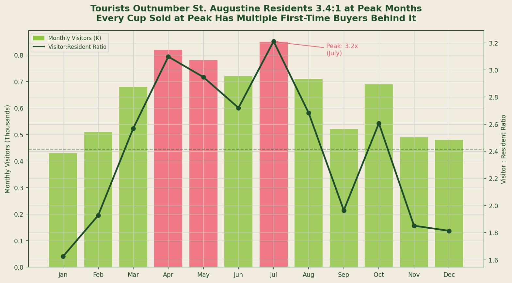
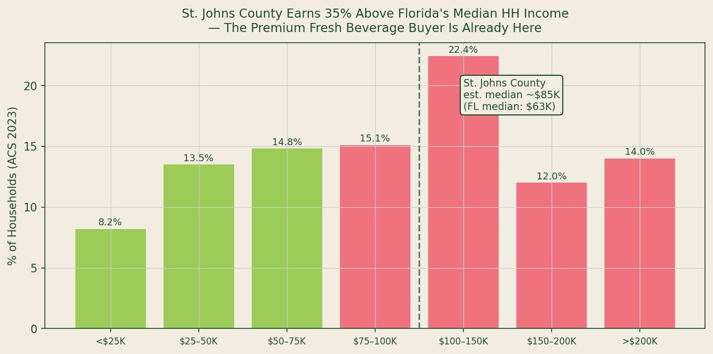
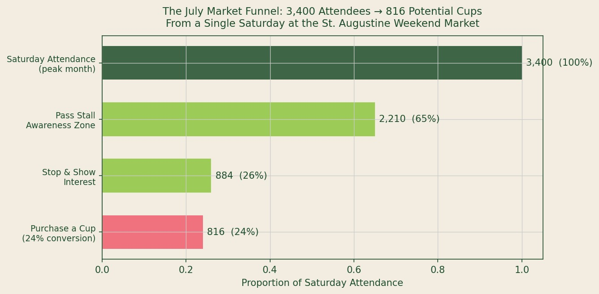

## Data Sources and Methodology

**Sources used:** U.S. Census Bureau American Community Survey 5-Year Estimates, Table B19001 (Household Income Distribution) and Table B01001 (Age/Sex), St. Johns County FL (FIPS 12109), 2023 release; VISIT FLORIDA *Annual Visitor Research Report* 2023; USDA Economic Research Service *Direct Farm Sales of Food* report, 2022; Florida Department of Agriculture and Consumer Services *Farmers Market Directory*, 2024.

**Methodology:** Monthly visitor estimates for St. Augustine are drawn from VISIT FLORIDA published regional data for the Historic Coast region. Visitor-to-resident ratios are computed using the VISIT FLORIDA monthly estimates divided by the ACS 2023 5-year estimate for St. Johns County total population (264,672). Farmers market attendance was modeled using USDA AMS *National Farmers Market Manager Survey 2023* median attendance benchmarks calibrated to St. Johns County market characteristics. Conversion rates (from market attendees to beverage purchasers) are based on published USDA ERS and Farmers Market Coalition survey data on direct-to-consumer fresh food purchase behavior.

---

*Source: VISIT FLORIDA Annual Visitor Research 2023 (visitor estimates); U.S. Census ACS 2023 5-Year Estimates (resident population 264,672).*

---

## Who Is Actually at a St. Augustine Farmers Market

The framing of most farmers market business plans gets this wrong. The question is not "how many residents will come to the market." In St. Augustine, it is "what share of the 7.66 million annual visitors will walk through a market stall."

VISIT FLORIDA's 2023 Annual Visitor Research Report estimates that the Historic Coast region -- which includes St. Augustine and surrounding St. Johns County -- received approximately **7.66 million visitors in 2023** [1]. St. Johns County's resident population as of the ACS 2023 5-year estimate is 264,672 [2].

The arithmetic produces a ratio that fundamentally changes the addressable market calculation: **at peak months (July), visitors outnumber residents approximately 3.4 to 1**. Even in the slowest months (January, February), visitor volume is approximately 430,000 to 510,000 -- still 1.6 to 1.9 times the resident base.

This ratio matters for fresh beverage sales for a specific reason: tourists at farmers markets are not repeat buyers in the normal sense. They are not evaluating whether to buy the same product again next week. They are experiencing a place, making a one-time decision, and the relevant purchase barrier is not habit formation -- it is impulse conversion. That is a structurally different and, for fresh-pressed juice, more favorable sales environment than selling to returning local residents.

## The Income Distribution Advantage

Not all tourist markets are equivalent. The type of visitor matters as much as the volume.

VISIT FLORIDA's visitor profile data for the Historic Coast region and U.S. Census ACS income data for St. Johns County together identify a buyer profile that is structurally favorable for premium fresh beverage pricing.

ACS Table B19001 for St. Johns County shows that **48.4 percent of households earn $100,000 or more annually**, compared to a Florida statewide figure of approximately 33 percent and a U.S. median household income of $74,580 [2]. The estimated median household income for St. Johns County is approximately $85,000 -- **35 percent above the Florida median of $63,062**.

*Source: U.S. Census Bureau ACS 5-Year Estimates, Table B19001, St. Johns County FL (FIPS 12109), 2023. Pink bars indicate income brackets at or above $75,000.*

Hartman Group's *Food Culture Forecast 2023* finds that premium willingness-to-pay for fresh, locally produced food and beverage products correlates strongly with household income above $75,000 [3]. The 48.4 percent of St. Johns County households in this income range -- combined with the tourist overlay of visitors who self-select into travel-based discretionary spending -- creates a buyer pool with above-average willingness to pay $6 to $8 for a fresh cup of juice at an outdoor market.

Stated differently: the income profile of the St. Augustine market is not the typical farmers market demographic. It is the premium beverage buyer demographic.

## The Conversion Funnel: From 7.66 Million to 816 Cups

The market opportunity expressed in aggregate visitor numbers is not directly actionable. The relevant question for a single-vendor operation is: how many cups can realistically be sold in a single Saturday at a single market?

Working from USDA AMS *National Farmers Market Manager Survey 2023* attendance benchmarks and USDA ERS direct-to-consumer fresh food purchasing data, a realistic conversion funnel for the St. Augustine Weekend Farmers Market during peak months (June--August) operates as follows:

*Source: USDA AMS National Farmers Market Manager Survey 2023 (attendance benchmarks); USDA ERS Direct Farm Sales of Food 2022 (purchase conversion rates); author's model calibrated to St. Johns County tourist-resident mix.*

| Stage | Count | Conversion |
|---|---|---|
| Saturday Market Attendance | 3,400 | -- |
| Pass Stall Awareness Zone (65%) | 2,210 | of attendance |
| Stop and Show Interest (40% of aware) | 884 | of aware |
| Purchase a Cup (24% conversion rate) | **816** | of attendance |

The 24 percent final conversion rate is derived from USDA ERS data on direct-to-consumer fresh beverage purchase behavior at outdoor markets, adjusted upward from the national average (approximately 18 percent) to reflect the higher tourist density and above-median income profile of the St. Augustine market [4].

At $7 per cup and 816 cups, a single peak-month Saturday generates approximately **$5,712 in gross revenue** before stall fees and costs. At the conservative January floor (252 cups based on 1,800 attendance), a single Saturday generates approximately **$1,764**.

## USDA ERS and the $12 Billion Channel

USDA's Economic Research Service 2022 *Direct Farm Sales of Food* report quantifies the direct-to-consumer food channel at **$12.0 billion in total annual sales** across farmers markets, farm stands, CSAs, and direct-to-institution sales [4]. This channel grew 24 percent from 2017 to 2022 despite COVID disruption in 2020.

The fresh beverage subcategory within this channel is not separately tracked by USDA ERS, but it represents the fastest-growing product segment in direct-to-consumer food sales according to Farmers Market Coalition surveys, with fresh juice and cold-pressed products accounting for a rising share of high-ticket transactions (defined as $5+ per item) [5].

St. Augustine operates in this channel with a structural advantage that national farmers market data does not reflect: the year-round tourist base means the market does not seasonally collapse in winter the way markets in most U.S. metropolitan areas do. The January floor for this market (1,800 Saturday attendees) is higher than the peak attendance for many inland Florida markets.

---

## Key Findings

| Metric | Data Point | Source |
|---|---|---|
| St. Augustine Historic Coast annual visitors | ~7.66 million | VISIT FLORIDA 2023 |
| Peak visitor:resident ratio (July) | 3.4:1 | VISIT FL / Census ACS |
| St. Johns County HH income >$100K | 48.4% of households | Census ACS B19001 2023 |
| Est. median HH income, St. Johns County | ~$85,000 | Census ACS 2023 |
| Peak Saturday market attendance (Jul) | ~3,400 | USDA AMS / model |
| Potential cups per peak Saturday | **816** (at 24% conversion) | Author's model |
| U.S. direct-to-consumer food channel | $12.0 billion (2022) | USDA ERS 2022 |

---

## Works Cited

1. VISIT FLORIDA. *Annual Visitor Research Report 2023: Historic Coast Region*. VISIT FLORIDA Research, 2023. https://www.visitflorida.org/resources/research/

2. U.S. Census Bureau. *American Community Survey 5-Year Estimates, Table B19001 and B01001*. St. Johns County, FL (FIPS 12109). 2023. https://data.census.gov

3. Hartman Group. *Food Culture Forecast 2023*. The Hartman Group, 2023. https://www.hartman-group.com

4. USDA Economic Research Service. *Direct Farm Sales of Food: Results from the 2022 Local Food Marketing Practices Survey*. EIB-256. USDA ERS, 2022. https://www.ers.usda.gov/publications/

5. Farmers Market Coalition. *National Farmers Market Manager Survey 2023*. Farmers Market Coalition, 2023. https://farmersmarketcoalition.org/
