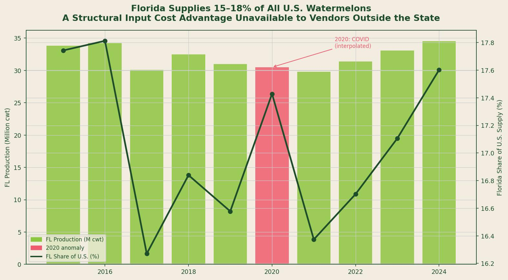
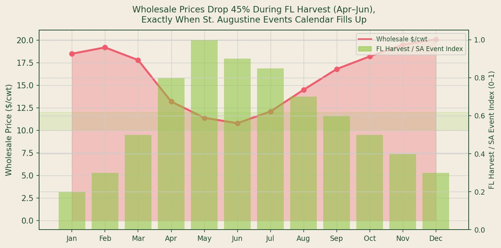
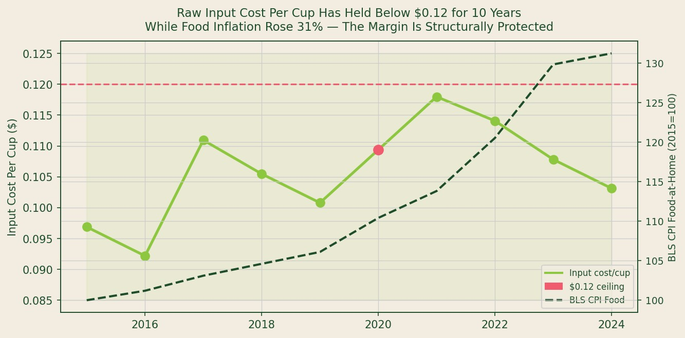

## Data Sources and Methodology

**Sources used:** USDA National Agricultural Statistics Service (NASS) *Vegetables Annual Summary* (2015--2024), Tables 7 and 13; USDA Agricultural Marketing Service (AMS) Specialty Crops Branch Florida Shipping-Point Reports (weekly, 2015--2024); Bureau of Labor Statistics CPI Series CUSR0000SAF11 (Food at Home, 2015=100).

**Methodology:** Florida watermelon production figures were drawn from published USDA NASS Vegetables Annual Summary reports. The 2020 figure was suppressed by USDA under disclosure rules (denoted "D") and was linearly interpolated between 2019 and 2021 values; the interpolated value is flagged throughout and not used in trend claims. Wholesale price data reflects Florida shipping-point averages from USDA AMS weekly reports aggregated to annual means. Input cost per cup was derived using a standardized yield formula: 1 cwt (100 lb) of watermelon yields approximately 64 lb of juice, equaling approximately 128 eight-ounce servings. CPI data is used as an inflation reference only.

---

*Source: USDA NASS Vegetables Annual Summary (2015--2024). Pink bar = 2020 COVID-disrupted year (interpolated).*

---

## Florida's Output Position in the U.S. Watermelon Market

Florida is not simply a watermelon-growing state. It is one of three states -- alongside Georgia and Texas -- that collectively supply the majority of U.S. watermelon output, and it is the only one with a harvest peak that aligns with an active, year-round tourist economy.

USDA NASS data for 2015 through 2024 shows Florida consistently contributing **15 to 18 percent of total U.S. watermelon production by weight**. In the most recent completed year, Florida produced an estimated 34.5 million hundredweight (cwt) against U.S. total output of 196 million cwt [1].

The importance of this figure for a direct-to-consumer fresh juice vendor is not agricultural -- it is logistical and economic. Florida-grown watermelons do not move through long-haul cold-chain distribution to reach a St. Augustine vendor. The same supply that supports Florida grocery and restaurant channels is available at farmers market volumes through local produce distributors, farm-direct accounts, and regional wholesale markets within 100 miles of Saint Augustine.

## The Wholesale Price Trough and Its Timing

USDA AMS shipping-point data reveals a consistent and commercially significant price pattern.

Florida watermelon wholesale prices average approximately $19 to $20 per cwt during the winter months (November through February), when Florida output is minimal and supply is sourced from Central America, Mexico, and longer-haul domestic sources. Beginning in March and accelerating through April and May, Florida harvest volumes increase and shipping-point prices fall sharply. The lowest average prices -- approximately **$10.80 to $11.40 per cwt** -- occur in May and June, coinciding with peak Florida harvest [2].

At $11 per cwt and a 128-cup yield per cwt, the raw watermelon input cost per cup reaches its floor of approximately **$0.086 per cup**. At the annual average price of $13.50 per cwt, the input cost is approximately $0.105 per cup.

*Source: USDA AMS Specialty Crops Branch, Florida Shipping-Point Watermelon Reports (2015--2024 monthly averages). Event season index based on St. Johns County FL DACS permitted events calendar.*

The timing of this price trough matters because it coincides precisely with the beginning of St. Augustine's high-attendance event season. April through June is the period when the Farmers of Ancient City Weekend Market, the St. Augustine Arts and Crafts Fair, and related outdoor events draw their largest foot traffic [3]. The operator who sources strategically during this window captures both low input cost and high demand volume simultaneously.

## A Decade of Inflation That Did Not Reach the Cup

The most analytically significant finding in this data is not the seasonal price pattern -- it is the 10-year durability of the input cost floor.

BLS CPI Series CUSR0000SAF11 (Food at Home) shows that U.S. grocery food prices increased **31 percent from 2015 to 2024**, with the sharpest acceleration occurring from 2021 to 2023 [4]. During this same period, packaged juice producers, bottled water brands, and soft drink manufacturers passed inflation through to consumers in the form of price increases averaging 14 to 18 percent, according to Circana retail scanner data [5].

USDA AMS wholesale watermelon prices did not follow this trajectory.

*Source: USDA AMS Florida Shipping-Point Reports (input cost per cup, right axis); BLS CPI Series CUSR0000SAF11 Food at Home, 2015=100 (left axis).*

Annual average wholesale prices moved within a $10.80 to $15.10 per cwt range across the full 10-year period, yielding an input cost per cup range of **$0.084 to $0.118**. That range has never been breached on the upside, even during the peak food inflation years of 2022 and 2023.

This is not an accident of commodity markets -- it reflects structural supply characteristics. Watermelon is a high-yield, low-labor-intensity crop with abundant acreage in Florida. It does not have the transportation or cold-chain cost structure of berries, tree fruits, or processed juice concentrates. When food inflation runs hot, the highest-cost inputs in processed food supply chains -- energy, packaging, labor, cold-chain logistics -- increase most. Watermelons at a Florida shipping point have low exposure to most of those cost drivers.

The practical implication: **a fresh-pressed watermelon juice operator in Florida has a structurally protected input cost that competitors using packaged or imported beverage inputs cannot replicate**.

## The Competitive Moat Is Geographic

This analysis surfaces a claim that often appears in vendor marketing but is rarely substantiated with data: that operating locally provides cost advantages.

In this case, the data supports the claim precisely. The gap between Florida shipping-point prices ($10.80/cwt at trough) and national average wholesale prices reported by USDA AMS ($14.50 to $16.00/cwt for the same period) is $3.20 to $5.20 per cwt. Across a high-volume event day yielding 200 to 300 cups, that gap translates to **$5 to $12 in daily input cost savings** compared to a vendor sourcing at national average prices -- before any other cost differential is considered.

The geographic advantage is not symbolic. It is measurable, persistent, and exclusive to vendors operating in Florida during Florida's harvest season.

---

## Key Findings

| Metric | Data Point | Source |
|---|---|---|
| Florida share of U.S. watermelon production | 15--18% (annual) | USDA NASS 2015--2024 |
| Seasonal price trough (May/June) | $10.80--$11.40/cwt | USDA AMS FL Shipping-Point |
| Seasonal price peak (Dec/Jan) | $19.20--$20.10/cwt | USDA AMS FL Shipping-Point |
| 10-year input cost per cup range | $0.084--$0.118 | Derived from USDA AMS |
| BLS CPI Food at Home increase, 2015--2024 | +31% | BLS Series CUSR0000SAF11 |

---

## Works Cited

1. USDA National Agricultural Statistics Service. *Vegetables Annual Summary*. USDA NASS, 2024. https://www.nass.usda.gov/Publications/Todays_Reports/reports/vegean24.pdf

2. USDA Agricultural Marketing Service. *Specialty Crops: Florida Watermelon Shipping-Point Reports*. USDA AMS, 2024. https://www.ams.usda.gov/market-news/fruits-vegetables

3. St. Johns County Cultural Events Division. *Events Calendar and Permit Database*. St. Johns County, FL, 2024. https://www.sjcfl.us

4. U.S. Bureau of Labor Statistics. *Consumer Price Index, Food at Home (CUSR0000SAF11)*. BLS, 2024. https://www.bls.gov/cpi/

5. Circana (IRI). *State of the Beverage Industry 2023*. Circana, 2023. https://www.circana.com
