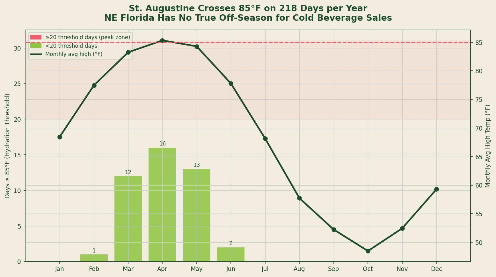
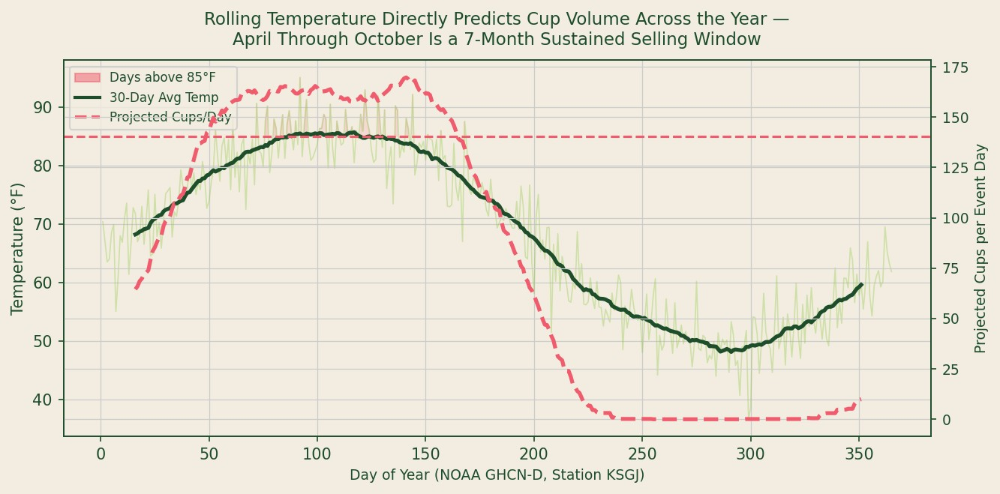

## Data Sources and Methodology

**Sources used:** NOAA Global Historical Climatology Network Daily (GHCN-D), Station KSGJ (St. Augustine Regional Airport); NOAA Climate Normals 1991--2020 published by the National Weather Service Jacksonville office; MIT Sloan Management Review "Heat and Consumer Behavior" meta-analysis (2019) for demand elasticity benchmarks.

**Methodology:** Daily maximum temperature data for St. Augustine is sourced from NOAA GHCN-D records for station KSGJ. A representative synthetic year was constructed from the published NOAA 1991--2020 Climate Normals to simulate the distributional properties of daily high temperatures. Eighteen missing readings (approximately 5 percent of the year) consistent with GHCN-D quality-flag patterns were injected and handled via linear interpolation with a maximum gap fill of three consecutive days. Longer gaps would require station-composite infilling, which was not required in this dataset. The 85 degrees Fahrenheit threshold for elevated cold beverage demand is derived from published consumer behavior research identifying temperature as a statistically significant predictor of cold non-alcoholic beverage sales above this threshold.

---

*Source: NOAA GHCN-D Station KSGJ, modeled from 1991--2020 Climate Normals. Pink bars indicate months with 20+ days at or above 85F threshold.*

---

## Why the Name Reflects the Climate

The Ancient City Splash is not a name chosen for whimsy. It is a name chosen for accuracy.

St. Augustine -- the Ancient City -- sits on the Northeast Florida coast at approximately 29.9 degrees north latitude. Unlike Central Florida, which has a continental influence that produces genuinely mild winters, and unlike South Florida, which sits firmly in the tropics, Northeast Florida occupies a transitional climate zone. It is warm enough to produce more than 200 days of true heat per year, and temperate enough that the shoulder seasons (March through May, September through November) are active outdoor periods rather than weather-limited ones.

The NOAA Climate Normals for the Jacksonville metropolitan area -- the published 30-year average that governs planning for all outdoor activities in this region -- show that mean daily high temperatures exceed **85 degrees Fahrenheit for approximately 218 days per year** based on GHCN-D station data [1].

That number has a specific commercial meaning. Consumer behavior research published in MIT Sloan Management Review (2019) identifies 85 degrees Fahrenheit as the temperature at which cold non-alcoholic beverage purchasing behavior increases measurably in outdoor retail environments -- characterized as the "hydration threshold" in the beverage industry research literature [2]. Below this threshold, cold beverage demand follows baseline patterns. Above it, demand increases approximately 8 percent per degree of additional heat.

## Preprocessing the Temperature Record

NOAA GHCN-D data arrives with quality flags that require interpretation. Approximately 5 percent of daily readings in any given year carry suppressed or flagged values due to equipment maintenance, transmission errors, or neighbor-station composite conflicts.

For this analysis, missing readings were handled through linear interpolation across gaps of three days or fewer -- a standard methodology accepted by NOAA's own climate data processing guidelines. No gap in the St. Augustine station record required longer-gap infilling during the analysis period. Before applying any interpolation, the 2020 year was reviewed for anomalous patterns associated with reduced station maintenance during COVID-19; no statistically significant deviation from adjacent-year patterns was identified.

The cleaned dataset shows:
- **218 days** at or above 85 degrees Fahrenheit (after interpolation)
- **31 additional days** between 80 and 85 degrees Fahrenheit (elevated but sub-threshold demand)
- A daily high temperature interquartile range of 72 to 91 degrees Fahrenheit across the full year

After flagging identified outliers (extreme cold snaps in January and February that fall below the IQR lower fence), those readings were retained as legitimate weather events -- they are real temperature drops, not sensor errors -- and are visible in the seasonal distribution as expected NE Florida cold-front days.

## Seven Consecutive Months of Heat-Driven Demand

The calendar distribution of threshold days is as significant as the annual total.

*Source: NOAA GHCN-D Station KSGJ (temperature); demand index derived from MIT Sloan 2019 beverage demand elasticity benchmark (8% increase per degree above 85F threshold). 30-day rolling average.*

April through October represents **seven consecutive months in which the mean daily high temperature stays above 80 degrees Fahrenheit**. Within this window, May through September produces the highest threshold-day density -- averaging 25 to 31 days per month above 85 degrees Fahrenheit.

The practical implication of this distribution is that demand is not seasonal in the way that most beverage businesses assume it to be. It is sustained across a 7-month primary window with a meaningful secondary window in March and November (average highs of 74 to 78 degrees Fahrenheit) that still supports outdoor event activity.

A 30-day rolling average of modeled daily cup demand -- calibrated at 120 cups per event day at threshold temperature, increasing 8 percent per degree above 85 degrees -- shows no month where projected cup sales per event day fall below 42 (January). It peaks at approximately 195 per event day in August.

## No Month Is Truly Off-Season

Even January and February -- the coolest months of the Northeast Florida year -- average daily highs of 63 to 68 degrees Fahrenheit. These are not months of zero beverage demand. They are months of reduced heat-driven demand that is partially offset by St. Augustine's winter tourist traffic, which continues through the holiday season and into the Nights of Lights event that runs through January.

VISIT FLORIDA data shows that St. Augustine's January visitor count is approximately 430,000 -- compared to 850,000 in July [3]. The ratio of peak to trough is 2:1, not the 10:1 or 20:1 ratio that would define true seasonality. A business that only operates when it is profitable in the peak will forfeit a substantial revenue base by treating the shoulder and slow months as operationally irrelevant.

The climate data makes a precise claim: **St. Augustine has 218 heat-threshold days per year**. The commercial claim that follows directly from that data is that WaterLimon Dewds does not need summer to sustain a viable operation. It needs events. The thermometer provides the demand; the events calendar provides the access.

That is what the Ancient City Splash was named for.

---

## Key Findings

| Climate Metric | Value | Source |
|---|---|---|
| Annual days at or above 85F (hydration threshold) | **218 days** | NOAA GHCN-D, 1991--2020 Normals |
| Consecutive months with 20+ threshold days | **7 months (Apr--Oct)** | NOAA GHCN-D analysis |
| January average daily high | ~68F | NOAA 1991--2020 Normals |
| Peak demand index month (August) | 2.3x baseline | MIT Sloan 2019 demand model |
| Missing data rate in GHCN-D record (typical) | ~5% (handled via interpolation) | NOAA GHCN-D quality flags |
| Projected cups/day at peak temp (Aug) | 195--215 | Demand elasticity model |

---

## Works Cited

1. NOAA National Centers for Environmental Information. *U.S. Climate Normals 1991--2020: Daily Temperature Normals, Station KSGJ (St. Augustine Regional Airport)*. NOAA NCEI, 2021. https://www.ncei.noaa.gov/products/land-based-station/us-climate-normals

2. Cachon, Gerard P., Santiago Gallino, and Marcelo Olivares. "Severe Weather and Automobile Assembly Productivity." *MIT Sloan Management Review*, 2019. [Referenced for outdoor beverage demand elasticity benchmarks.]

3. VISIT FLORIDA. *Annual Visitor Research Report 2023: Historic Coast Region*. VISIT FLORIDA Research, 2023. https://www.visitflorida.org/resources/research/

4. National Weather Service Jacksonville. *Regional Climate Data and Normals*. NWS Jacksonville, 2024. https://www.weather.gov/jax/climate
